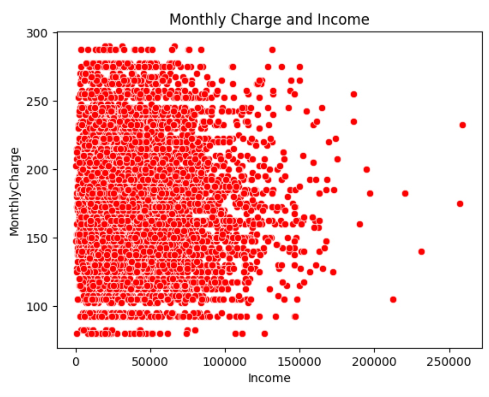
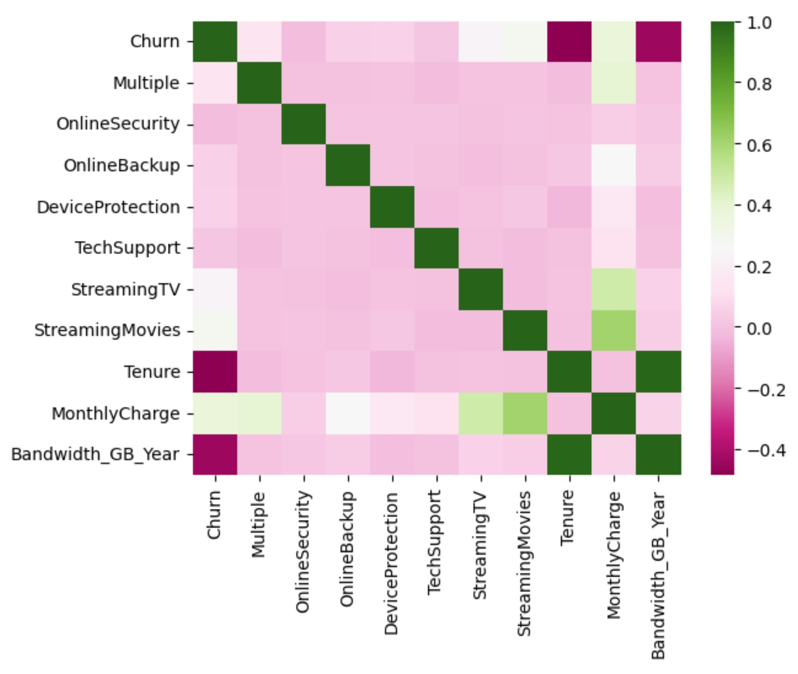
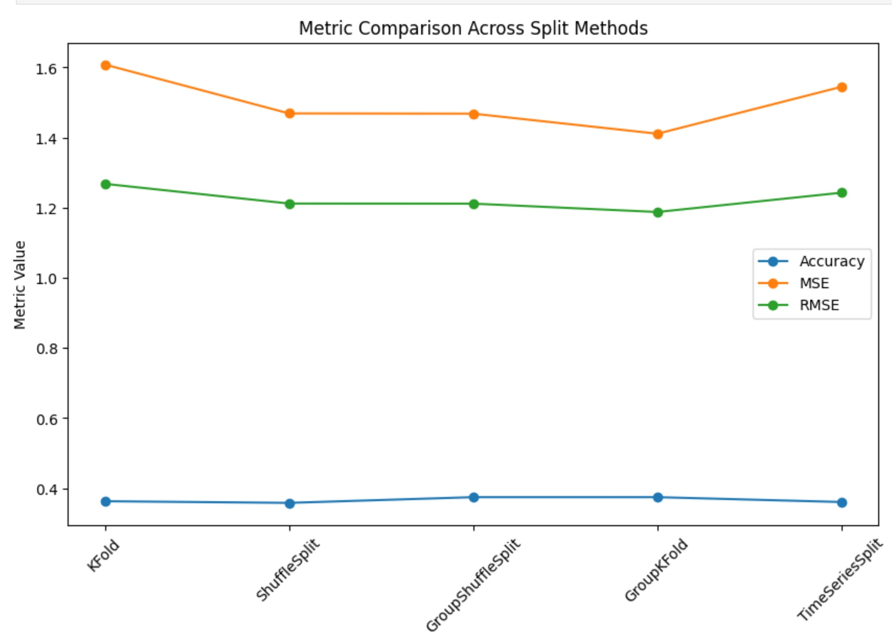

# Portfolio 
Example data science portfolio 
# [EDA:T-test to Evaluate the Impact of Monthly Charge on Churn](https://github.com/computerscienceiscool/EDA)
<!-- -->

Exploratory Data Analysis (EDA) is a critical step in understanding and interpreting data before delving into complex modeling or analysis. In this tutorial, we will perform an EDA using Python to examine the relationship between monthly charge and churn in a telecom dataset. Specifically, we will employ a T-test to determine if there is a significant difference in the monthly charges between customers who churn and those who do not.  
### Dataset Description
Our dataset contains information about telecom customers, including their monthly charge and churn status (whether they have churned or not). We aim to explore whether the monthly charge has a discernible impact on churn.
 
By following these steps, we will gain insights into the relationship between monthly charge and churn in the telecom dataset. The T-test will allow us to determine if the observed differences in monthly charges between churned and non-churned customers are statistically significant.
 

# [Multiple Linear Regression for Customer Behavior Prediction](https://github.com/computerscienceiscool/Portfolio)
<!-- --> 

This Python code analysis delves into the usage of predictive analytics, specifically applying multiple logistic regression for customer behavior prediction in terms of bandwidth usage. The primary objective is to employ proactive strategies to predict churn usage, thereby optimizing the customer experience.

The analysis seeks to test a hypothesis: Can we use logistic regression as an efficient tool to predict churn usage given a specific dataset?

# [TestingTheSplit](https://github.com/computerscienceiscool/TestingTheSplit)
<!-- -->

Testing several split methods with the same input.  This is a work in progress and it needs to be cleaned.

The different methods of splits include K Fold, Shuffle Split, Group Shuffle Split, Group K Fold, and the Time Series Split
